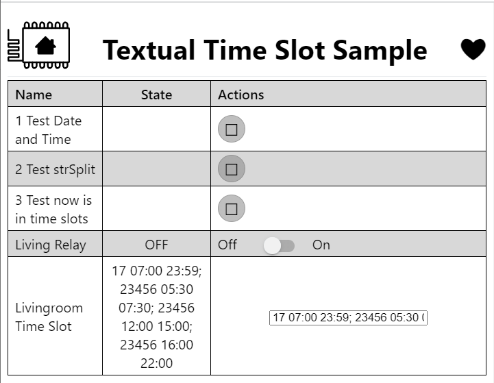

# esphome-yaml-prj
Some yaml and .h for esphome

## Textual Time Slot Sample
Example of using a Template Text component to define some time slots, to check whether the current time falls within a time slot or not.

### Usage
Pay attention: there is not any convalidation of text, so check and respect the format.

```yaml
esphome:
  name: test
  includes:
    - header-files/TextualTimeSlot.h

...

text:
  - platform: template
    name: "Livingroom Time Slot"
    id: livingroom_time_slot
    initial_value: "17 07:00 23:59; 23456 05:30 07:30; 23456 12:00 14:00; 23456 16:00 22:00"
    # Slots separator: "; "
    # n. 3 field for slot separated by one white space
    #   [1-7] 1: Sunday ... 7: Saturday
    #   07:00 Start from 00:00 and less than Stop
    #   23:59 Stop greater than Start and less or equal to 23:59
    optimistic: true
    min_length: 0
    max_length: 255 # max. is only 255
    mode: text

button:
  - platform: template
    name: 3 Test now is in time slots
    on_press:
      then:
        if:
          condition:
            lambda: return isInTimeSlots( id(livingroom_time_slot).state );
          then:
            - switch.turn_on: livingroom_relay
          else:
            - switch.turn_off: livingroom_relay

switch:
  - platform: gpio
    pin: 25
    name: "Living Relay"
    id: livingroom_relay

time:
  - platform: sntp
    id: sntp_time  # don't rename this
```
### Screenshot
